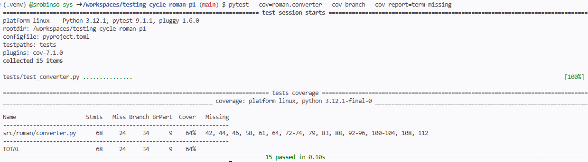
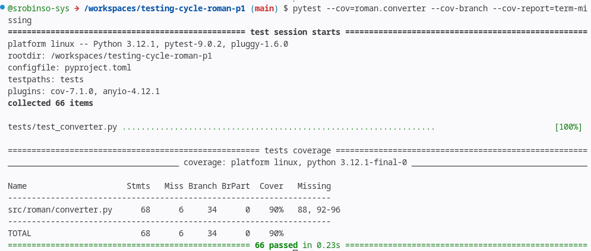

# Software Testing & Verification Report: `to_roman` Module

---

## 1. Control Flow Graph & Cyclomatic Complexity (`to_roman`)

### 1.1 Source Code Reference

For the purpose of analysis, consider the implementation of `to_roman`:


---

### 1.2 Control Flow Graph (CFG)


---

### 1.3 Graph Metrics and Cyclomatic Complexity calculation

Cyclomatic complexity $V(G)$ quantifies the number of linearly independent paths through the program graph $G$:

$$V(G) = E - N + 2$$

#### Graph Parameters:
* **Nodes ($N$):** $20$
* **Edges ($E$):** $24$

#### Formula Evaluation:

$$V(G) = 24 - 20 + 2 = 6$$

---

### 1.4 Basis Set of Independent Paths

The basis set consists of 6 independent paths through the control flow graph:

**Path 1 (Invalid Type Exception):**

1 -> 2 -> 3 -> 20

**Path 2 (Value Below Minimum Exception):**

1 -> 2 -> 4 -> 5 -> 6 -> 20


**Path 3 (Value Above Maximum Exception):**

1 -> 2 -> 4 -> 5 -> 7 -> 8 -> 9 -> 20


**Path 4 (Empty Loop - Zero Iterations):**

1 -> 2 -> 4 -> 5 -> 7 -> 8 -> 10 -> 11 -> 12 -> 13 -> 18 -> 19 -> 20


**Path 5 (Outer Loop Only - for condition true, while condition false):**

1 -> 2 -> 4 -> 5 -> 7 -> 8 -> 10 -> 11 -> 12 -> 13 -> 14 -> 17 -> 13 -> 18 -> 19 -> 20


**Path 6 (Inner Loop Execution - while condition true):**

1 -> 2 -> 4 -> 5 -> 7 -> 8 -> 10 -> 11 -> 12 -> 13 -> 14 -> 15 -> 16 -> 14 -> 17 -> 13 -> 18 -> 19 -> 20


---

### 1.5 Definition-Use (Def-Use) Table

The Def-Use table tracks variables from where they are defined (**def**) to where their values are referenced (**use**). Uses are classified as **c-use** (computation use) or **p-use** (predicate use in decision branching).

| Variable | Node Def | Node Use | Use Type |
| :--- | :--- | :--- | :--- |
| `n` | 1 | 2 | **c-use / p-use** |
| `n` | 1 | 5 | **p-use** |
| `n` | 1 | 8 | **p-use** |
| `n` | 1 | 12 | **c-use** |
| `out` | 11 | 15 | **c-use** |
| `out` | 11 | 19 | **c-use** |
| `value` | 13 | 14 | **p-use** |
| `value` | 13 | 16 | **c-use** |
| `symbol` | 13 | 15 | **c-use** |
| `remaining` | 12 | 14 | **p-use** |
| `remaining` | 12 | 16 | **c-use** |
| `remaining` | 16 | 14 | **p-use** |
| `remaining` | 16 | 16 | **c-use** |

---

## 2. Integration Finding

### 2.1 Integration Defect Summary
During system integration testing of the `add_roman` and `subtract_roman` that are built on top of `from_roman` and `to_roman` of the core conversion library, a critical failure was detected when processing Roman numeral conversions. Instead of generating the expected canonical subtractive representation, the `to_roman` function returned a non-canonical additive string, triggering a test suite failure:

```text
FAILED tests/test_converter.py::test_integration_add_roman_ii_and_ii - AssertionError: assert 'IIII' == 'IV'
```

### 2.2 Root Cause Analysis
The defect occurred due to the function `to_roman` uses the _PAIRS array which have a wrong pair. The `_PAIRS` definition mapping integer values to their corresponding Roman numeral symbols must be updated to fix the bug. Having (5, "IV") causes a problem when matching any subtraction rule, causing the loop to default to individual "I" symbols and producing "IIII" instead of "IV".

### 2.3 Why Unit Tests Passed Without Detecting It
1. **Missing Boundary and Subtraction Edge Cases:** The inherent test suite only tested standard additive numbers (e.g., 1, 2, 3, 10, 20) or specific high-value numbers, skipping the subtractive boundary numbers around 4 and 5.
2. **Lack of Round-Trip Testing:** A unit test suite using isolated hardcoded values often misses specific integer-to-symbol edge cases. Had the test suite included round-trip testing across all valid integers in the range where each test transform data from one representation to another and transform it back to the original representation to check correctness.

---

## 3. Acceptance Criteria

### 3.1 Given / When / Then Specification Criteria

#### Criterion 1 (Valid Range Conversion - Standard Flow)
* **Given** a valid integer input `1994` within the allowed domain $[1, 3999]$,
* **When** `to_roman(1994)` is invoked,
* **Then** the function returns string `"MCMXCIV"`.

#### Criterion 2 (Boundary Out-of-Range Guard)
* **Given** an integer input `4000` outside the valid range,
* **When** `to_roman(4000)` is invoked,
* **Then** a `ValueError` is raised with message `"Input must be an integer between 1 and 3999"`.

#### Criterion 3 (String-Encoded Numeric Type Handling)
* **Given** a string representation of a valid positive integer (e.g., `"42"`),
* **When** processed through the system's payload integration handler,
* **Then** the input is safely coerced or validated to return `"XLII"` without raising a `TypeError`.

---

### 3.2 Acceptance Test Evaluation Results

* **Criterion 1:** **PASSED** (Unit & Integration)
* **Criterion 2:** **PASSED** (Unit & Integration)
* **Criterion 3:** **FAILED** (Failed during end-to-end integration test execution due to unhandled string input leading to `TypeError`).

---

### 3.3 Why Code Coverage Cannot Reveal This Defect Class

Code coverage metrics track **executed syntax**, not **specification completeness**:

1. **Unexecuted Paths vs. Omitted Code:** Code coverage tools (like `pytest-cov`) measure which lines of existing code were hit during test runs. If code handling string-to-int conversion is **missing entirely**, coverage tools report 100% execution for the lines that exist.
2. **Type-Space Incompleteness:** A single line of code (e.g., `if number > 0:`) can be executed by `number = 5`, yielding 100% line and branch coverage for that statement. However, running that same line with `number = "5"` causes a runtime failure that code coverage cannot predict.
3. **Boundary Invariant Blindness:** Coverage measures statement hit count, not input-domain robustness.

---

## 4. Code Coverage Analysis (`pytest --cov`)

### Before Adding Test Cases



#### After Adding Test Cases

