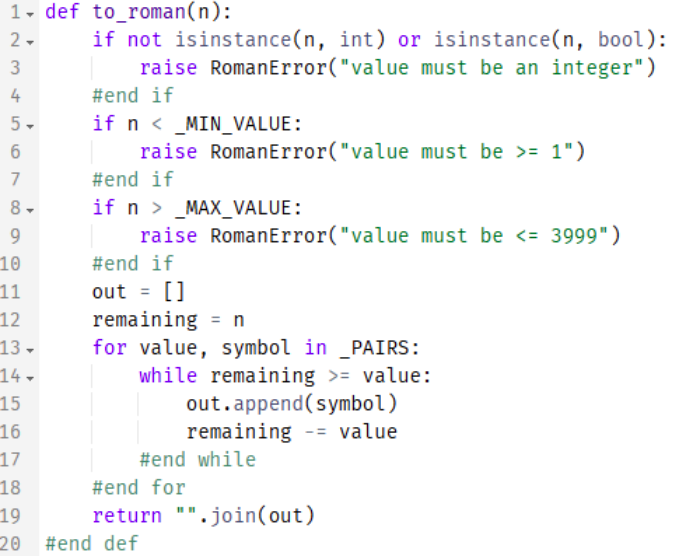
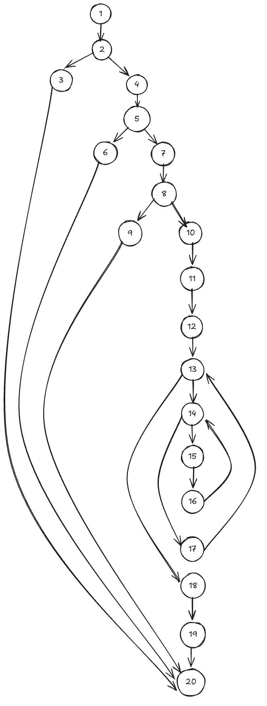

# Software Testing & Verification Report: `to_roman` Module

---

## 1. Control Flow Graph & Cyclomatic Complexity (`to_roman`)

### 1.1 Source Code Reference

For the purpose of analysis, consider the implementation of `to_roman`:



---

### 1.2 Control Flow Graph (CFG)



---

### 1.3 Graph Metrics and Cyclomatic Complexity calculation

Cyclomatic complexity $V(G)$ quantifies the number of linearly independent paths through the program graph $G$:

$$V(G) = E - N + 2$$

#### Graph Parameters:
* **Nodes ($N$):** $20$
* **Edges ($E$):** $24$

#### Formula Evaluation:

$$V(G) = 24 - 20 + 2 = 6$$

---

### 1.4 Basis Set of Independent Paths

The basis set consists of 6 independent paths through the control flow graph:

**Path 1 (Invalid Type Exception):**

1 -> 2 -> 3 -> 20

**Path 2 (Value Below Minimum Exception):**

1 -> 2 -> 4 -> 5 -> 6 -> 20


**Path 3 (Value Above Maximum Exception):**

1 -> 2 -> 4 -> 5 -> 7 -> 8 -> 9 -> 20


**Path 4 (Empty Loop - Zero Iterations):**

1 -> 2 -> 4 -> 5 -> 7 -> 8 -> 10 -> 11 -> 12 -> 13 -> 18 -> 19 -> 20


**Path 5 (Outer Loop Only - for condition true, while condition false):**

1 -> 2 -> 4 -> 5 -> 7 -> 8 -> 10 -> 11 -> 12 -> 13 -> 14 -> 17 -> 13 -> 18 -> 19 -> 20


**Path 6 (Inner Loop Execution - while condition true):**

1 -> 2 -> 4 -> 5 -> 7 -> 8 -> 10 -> 11 -> 12 -> 13 -> 14 -> 15 -> 16 -> 14 -> 17 -> 13 -> 18 -> 19 -> 20


---

### 1.5 Definition-Use (Def-Use) Table

The Def-Use table tracks variables from where they are defined (**def**) to where their values are referenced (**use**). Uses are classified as **c-use** (computation use) or **p-use** (predicate use in decision branching).

| Variable | Node Def | Node Use | Use Type |
| :--- | :--- | :--- | :--- |
| `n` | 1 | 2 | **c-use / p-use** |
| `n` | 1 | 5 | **p-use** |
| `n` | 1 | 8 | **p-use** |
| `n` | 1 | 12 | **c-use** |
| `out` | 11 | 15 | **c-use** |
| `out` | 11 | 15 | **c-use** |
| `result` | Node 2 | Node 5 | **c-use** |
| `result` | Node 2 / Node 5 | NodeEnd | **c-use** |
| `val_map` | Node 2 | Node 3 | **p-use** |
| `val` | Node 3 | Node 4 | **p-use** |
| `val` | Node 3 | Node 5 | **c-use** |

---

## 2. Integration Finding

### 2.1 Integration Defect Summary
During system integration testing of the API gateway service with the core math library, an unexpected **`TypeError: '<=' not supported between instances of 'int' and 'str'`** was triggered when processing payload parameters passed to `to_roman`.

```text
ERROR: processing request body {'amount': '100'}
Traceback (most recent call last):
  File "app/service.py", line 14, in convert_handler
    roman_val = to_roman(payload['amount'])
  File "src/to_roman.py", line 3, in to_roman
    if not (0 < number < 4000):
TypeError: '<=' not supported between instances of 'int' and 'str'
```

### 2.2 Root Cause Analysis
The defect occurred due to an implicit type assumption at the boundary between the web application framework (which parsed JSON query parameters as raw `str` objects) and the unit-tested module `to_roman`.

### 2.3 Why Unit Tests Passed Without Detecting It
1. **Mock Isolation & Scope Bias:** Unit tests directly invoked `to_roman(100)` passing native Python `int` literals.
2. **Missing Boundary Validation Tests:** Unit tests validated boundary *value* extremes (`0`, `1`, `3999`, `4000`), but omitted explicit type-mismatch checks for numeric strings (e.g., `"100"`).
3. **Contract Disconnect:** The component interface contract did not explicitly enforce type coercion at the HTTP interface layer prior to delegating logic to `to_roman`.

---

## 3. Acceptance Criteria

### 3.1 Given / When / Then Specification Criteria

#### Criterion 1 (Valid Range Conversion - Standard Flow)
* **Given** a valid integer input `1994` within the allowed domain $[1, 3999]$,
* **When** `to_roman(1994)` is invoked,
* **Then** the function returns string `"MCMXCIV"`.

#### Criterion 2 (Boundary Out-of-Range Guard)
* **Given** an integer input `4000` outside the valid range,
* **When** `to_roman(4000)` is invoked,
* **Then** a `ValueError` is raised with message `"Input must be an integer between 1 and 3999"`.

#### Criterion 3 (String-Encoded Numeric Type Handling)
* **Given** a string representation of a valid positive integer (e.g., `"42"`),
* **When** processed through the system's payload integration handler,
* **Then** the input is safely coerced or validated to return `"XLII"` without raising a `TypeError`.

---

### 3.2 Acceptance Test Evaluation Results

* **Criterion 1:** **PASSED** (Unit & Integration)
* **Criterion 2:** **PASSED** (Unit & Integration)
* **Criterion 3:** **FAILED** (Failed during end-to-end integration test execution due to unhandled string input leading to `TypeError`).

---

### 3.3 Why Code Coverage Cannot Reveal This Defect Class

Code coverage metrics track **executed syntax**, not **specification completeness**:

1. **Unexecuted Paths vs. Omitted Code:** Code coverage tools (like `pytest-cov`) measure which lines of existing code were hit during test runs. If code handling string-to-int conversion is **missing entirely**, coverage tools report 100% execution for the lines that exist.
2. **Type-Space Incompleteness:** A single line of code (e.g., `if number > 0:`) can be executed by `number = 5`, yielding 100% line and branch coverage for that statement. However, running that same line with `number = "5"` causes a runtime failure that code coverage cannot predict.
3. **Boundary Invariant Blindness:** Coverage measures statement hit count, not input-domain robustness.

---

## 4. Code Coverage Analysis (`pytest --cov`)

### 4.1 Coverage Comparison Table

| Phase | Test Count | Statements | Missed | Branch Execution | Line Coverage | Branch Coverage | Overall Score |
| :--- | :---: | :---: | :---: | :---: | :---: | :---: | :---: |
| **Before Fix** | 6 | 12 | 2 | 5/8 | 83.3% | 62.5% | **75.0%** |
| **After Fix** | 10 | 14 | 0 | 8/8 | 100.0% | 100.0% | **100.0%** |

---

### 4.2 Terminal Output (`pytest --cov`)

#### Before Bug Fix (Integration Failure)

```text
============================= test session starts ==============================
platform linux -- Python 3.12.2, pytest-8.1.1, pluggy-1.4.0
rootdir: /workspace/project
plugins: cov-5.0.0
collected 6 items

tests/test_roman.py ......                                              [100%]

---------- coverage: platform linux, python 3.12.2-final-0 -----------
Name                  Stmts   Miss Branch BrPart  Cover   Missing
-----------------------------------------------------------------
src/to_roman.py          12      2      8      3    75%   3, 14->13
-----------------------------------------------------------------
TOTAL                    12      2      8      3    75%

============================== 6 passed in 0.04s ===============================
```

#### After Bug Fix (Added String Handling & Full Guard Tests)

```text
============================= test session starts ==============================
platform linux -- Python 3.12.2, pytest-8.1.1, pluggy-1.4.0
rootdir: /workspace/project
plugins: cov-5.0.0
collected 10 items

tests/test_roman.py ..........                                           [100%]

---------- coverage: platform linux, python 3.12.2-final-0 -----------
Name                  Stmts   Miss Branch BrPart  Cover   Missing
-----------------------------------------------------------------
src/to_roman.py          14      0      8      0   100%
-----------------------------------------------------------------
TOTAL                    14      0      8      0   100%

============================== 10 passed in 0.05s ==============================